# Flask and Rabbitmq based web service with message queue

# Documentation/How to use
## Running web service locally

You can, If you wish, run things on your local machine, without using Docker and/or Kubernetes

For that to work, you will need to install RabbitMQ following instructions found [HERE](https://www.rabbitmq.com/download.html)

You will also need to have [Python3](https://www.python.org/downloads/) installed so you can either run the app via terminal or using your favourite IDE

Then, to get required packages installed in one go, you can use the provided `requirements.txt` file that is located inside `app-directory` directory.

Simply navigate via terminal to the location where you put your `payload-validator-main` directory, then run:
 ```bash
pip install -r payload-validator-main/app-directory/requirements.txt
```
Then you can simply run the app via terminal using:
 ```bash
python3 payload-validator-main/app-directory/flask_app.py
```
Or launching using an IDE like [VSCODE](https://code.visualstudio.com/)

:warning: These steps assumed you downloaded the zip directly from Github. If you cloned the repo using proper git commands then the perent directory `payload-validator-main` is simplified to `payload-validator`, adjust the commands above and below accordingly.

---

### Sending a JSON payload


The web service was tested using [Postman](https://www.postman.com/downloads/) api platform.

There is a browser based version of Postman, however, since the service is running locally, you will need to download and install it on your machine for it to work.

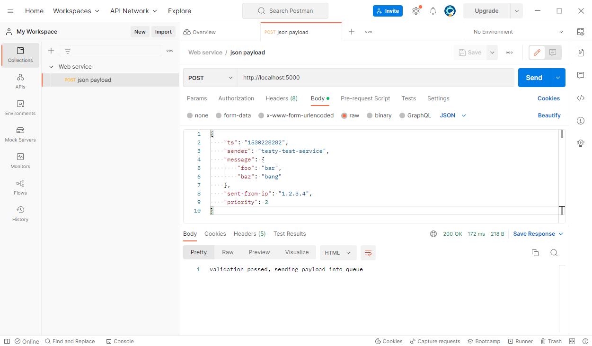

Here is an example of a JSON payload being sent into queue.

To send a payload, you will first need to click on the `+` sign on the top left hand side to create a new collection. After that, you add a request to your newly created collection.
Inside the request, you need to specify that it is a `POST` request from the dropdown menu, then add:     
 ```bash
http://localhost:5000
```
to your request URL .

Below that, you will see the option bar, select `Body`, check the `raw` option, then select JSON from the dropdown menu as shown in image below:

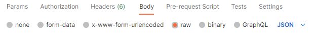

Finally, you will need to specify the actual request body. Here is an example of how it looks like:

```python
{
    "ts": "1530228282",
    "sender": "testy-test-service",
    "message": {
        "foo": "bar",
        "baz": "bang"
    },
    "sent-from-ip": "1.2.3.4",
    "priority": 2
}
```
There are validation rules in place that your JSON payload needs to comply to, those are as follows:
* “ts” must be present and a valid Unix timestamp
* “sender” must be present and a string
* “message” must be present, a JSON object, and have at least one field set
* If present, “sent-from-ip” must be a valid IPv4 address
* All fields not listed in the example above are invalid, and should result in the message being rejected.

If any of these fail, you will receive one of the many self descriptive error messages back into Postman, stating where the problem was. Also, the python app itself will show on which step it has failed, so you know which fields are correct and what you need to fix.
Otherwise, if each validation step passes without problems, you will receive "validation passed, sending payload into queue" message back, as seen in the example images above.

---

## Viewing message queue

Now that we have have passed the Payload into queue, we might want to check out if the queue contains our payload. To do so, RabbitMQ provides a management interface that allows us to see what is happening on the RabbitMQ side of things.
To access that, we simply enter:
 ```bash
http://localhost:15672
```
inside our browser that is located on the same machine as both the RabbitMQ server and web service.

You will then be greeted by a window that looks like this:

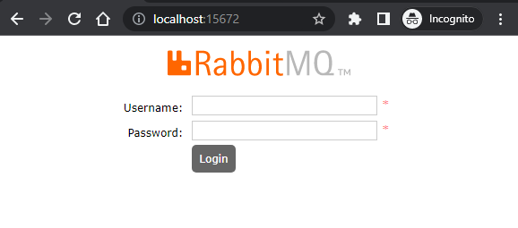

To login, you can enter default credentials:

Username: `guest`

Password: `guest`

Once logged in, you will see an overview window that shows various statistics.

Navigate to the Queues window, and if everything is up and running you should see something like this:

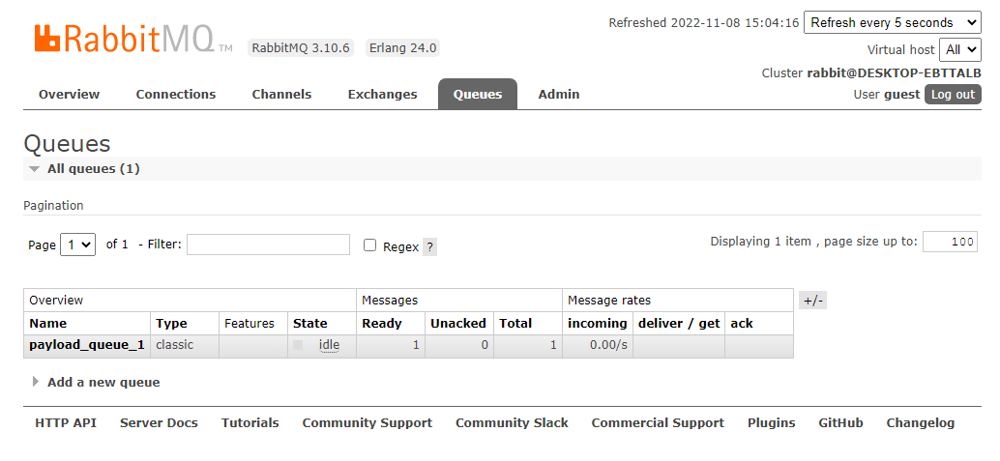

You should have 1 queue called `payload_queue_1`, and also the number of messages you have sent using Postman in the `ready` column. 

Click on the queue's name to open it up.

You should now see `Get messages` as one of the tabs, click on it, then click `Get Message(s)` button, you then should see your payload contents like this:

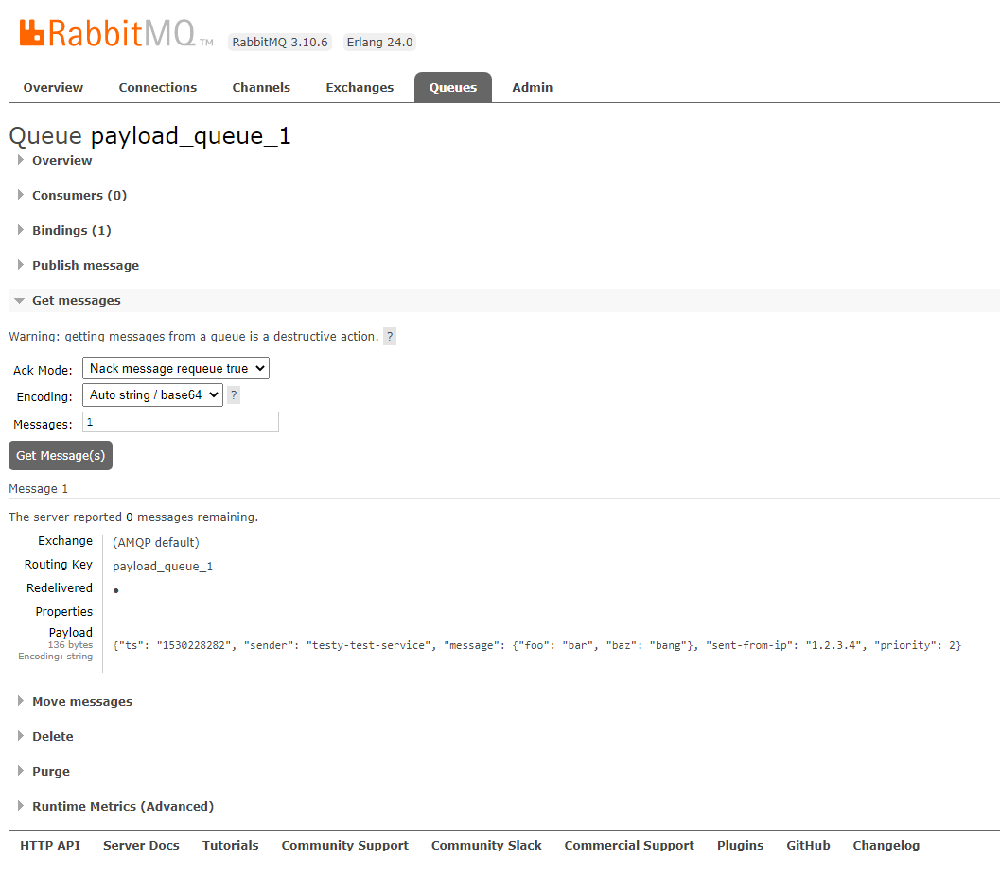

Which means your payload is indeed inside the queue and is waiting to be passed to the consumer.

:warning: The queue does not have persistance configured, which means if the RabbitMQ server/management goes down, your messages that are stuck inside queue will be lost!

---
## Docker:

Now that we got basic usage out of the way, we can implement this using Docker containers.

You will need to install and configure [Docker engine](https://docs.docker.com/engine/install/) or [Docker desktop](https://docs.docker.com/get-docker/) beforehand.

First, let’s start with RabbitMQ.
 
Create a new Docker network using this command:
 ```bash
docker network create web-net
```
You can change `web-net` network name to your liking, however, you will need to change the code below accordingly to accomodate these changes.

Navigate to a directory you placed the payload-validator-main directory at, then
navigate to RabbitMQ directory
 ```bash
cd payload-validator-main/rabbitmq-directory/
```
Then build an image from the Dockerfile (You can change the tag name as you please):
 ```bash
docker build -t rabbitmq:latest .
```
Finally, start the container:
 ```bash
docker run -it --rm -d --name rabbitmq -p 5672:5672 -p 15672:15672 --net web-net rabbitmq:latest
```
As you can see, it has parameters such as `-d` for detached mode so that we can continue using current instance of terminal, while `--net web-net`
will add this container to our created network, which is very important, it won’t work otherwise. `--name rabbitmq` is important as well, if you wish to use another name you would need to change environmental variables inside the app-directory’s Dockerfile, since we use containers name to connect the application to RabbitMQ 


Now we need to do the same to the web application.

Navigate to Flask app’s directory:
 ```bash
cd ../app-directory/
```
Build an image from Dockerfile for the app
 ```bash
docker build -t flask-app:latest .
```
Then start the app's container:
 ```bash
docker run --name flask-app --net web-net -p 5000:5000 flask-app:latest
```
`--name flask-app` is not so important this time, we can change app's container name freely. `--net web-net` still holds the same importance, since both containers need to run on same Docker network.


Now we can send the payload via Postman and check the queue contents the same way as described in [previous](#Sending-a-JSON-payload) [steps](#Viewing-message-queue)


---

## Kubernetes:

We will be using [minikube](https://minikube.sigs.k8s.io/docs/start/) to run our cluster locally. 

:warning: This documentation was written with the assumtion that minikube will be used, functionallity is not guaranteed if you use any other local cluster tools or cloud providers and the commands below will not work!

Start your minikube cluster using:
```bash
minikube start --driver=docker
```
It will start your cluster using Docker as your VM, assuming you followed previous steps, you should have docker already installed on your machine, so it makes sense to use it instead of downloading something else additionally.


First, we need to make sure that minikube has access to local image repository by running this:
```bash
eval $(minikube docker-env)
```
:warning: This command needs to be entered every time we start our minikube cluster so that correct repository is selected.

Rebuild our Docker images inside our new local image repository
```bash
docker build -t flask-app:latest ./app-directory
docker build -t rabbitmq:latest ./rabbitmq-directory
```

Create a namespace to organise resources:
```bash
kubectl create namespace web-namespace
```
Apply K8 manifests:
```bash
kubectl apply -f rabbitmq-statefulset.yaml
kubectl apply -f rabbitmq-service.yaml
kubectl apply -f flask-deployment.yaml
kubectl apply -f flask-service.yaml
```

We should have 2 pods, 2 services, 1 deployment, 1 replicaset, 1 statefulset running if everthing is correct, to check that run:
```bash
kubectl get all -n web-namespace
```
Where `-n web-namespace` is the namespace we have created beforehand, do not omit this, otherwise you will get an output of default namespace, which we do not want, since our stuff was setup to run on `web-namespace` namespace.

The output should look something like this:
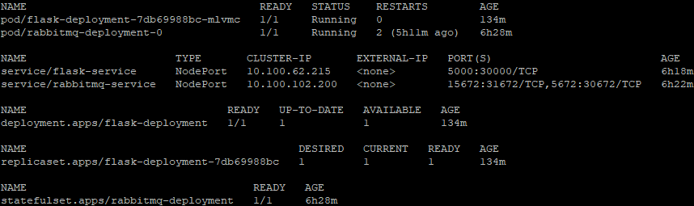

Make sure that everything is ready and running(which might take some time), otherwise you might have a problem.


There is a difference in how we send the payload and access the managment UI in Kubernetes. In the previous steps, we used `http://localhost:Port`, however, since both our browser and Postman is outside minikube cluster, we can not use localhost. Instead, we will need to provide our Node IP address and different ports due to how manifests are configured.

To get your node IP, run:
```bash
kubectl get nodes -o yaml | grep -- "- address:"
```
The output should look something like this:

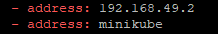

The `address` field that has IP is your Node IP address.

So, now that we have IP part of the URL, what about the ports?

We used `Port 5000` for Payload and `Port 15672` for RabbitMQ management, however, due to how service manifests are set up, the ports are now changed to:

`Port 30000` for payload

`Port 31672` for RabbitMQ management

So, to send payload use:
```bash
http://node-ip:30000
```
And to access rabbitmq management, use:
```bash
http://node-ip:31672
```
Where `node-ip` is your Node IP address you got when running the previous command.

Now our URL's should look something like this:

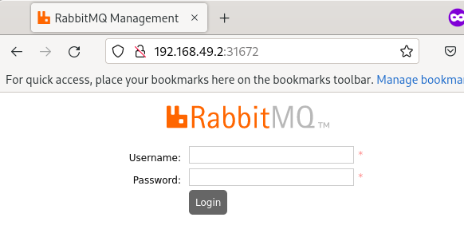

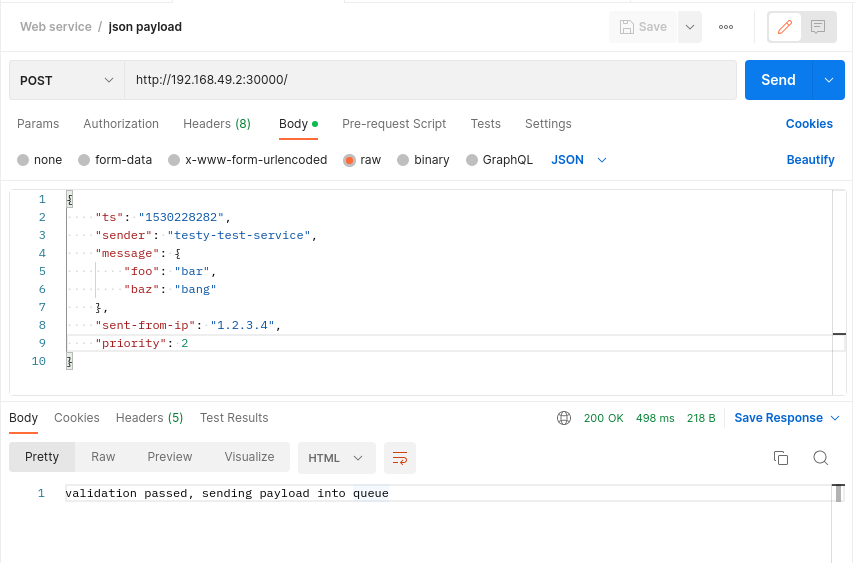

#### Check the logs

To see what our application is doing, we might want to check the logs.

First you need to get the pod name, to do that run:

```bash
kubectl get pods -n web-namespace
```

You should see 2 pods running.

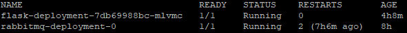

To access logs, run:

```bash
kubectl logs -f -n web-namespace podname
```
Where `podname` is the name and id assigned to your desired pod.

In this case it would be:
```bash
kubectl logs -f -n web-namespace flask-deployment-7db69988bc-mlvmc 
```
The `-f` flag is optional, it will show the logs in realtime

#### OPTIONAL
#### Setup Ingress

Ingress allows us to access our services using a convenient DNS name instead of specifying Node IP and ports.
After setting it up, we will be able to send our payload using `mypayload.com` and access our RabbitMQ management using `myrabbit.com`

First, enable the NGINX ingress controller:
```bash
minikube addons enable ingress
```

Then apply the Ingress manifest:
```bash
kubectl apply -f ingress.yaml
```
Now edit your [hosts](https://www.hostinger.com/tutorials/how-to-edit-hosts-file) file by adding your Node IP and `mypayload.com`, `myrabbit.com` domain names at the bottom of the file.

It should look something like this after you are done:

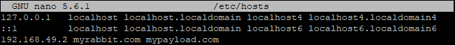

Save it and run:
```bash
kubectl get ingress -n web-namespace
```
You should see ingress-app running with hosts `myrabbit.com`, `mypayload.com` configured:

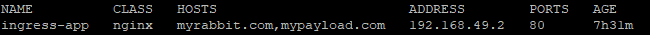

Test if everything is working properly by using `myrabbit.com` to access the RabbitMQ management:

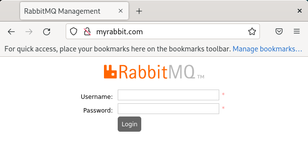

And mypayload.com to send the payload:

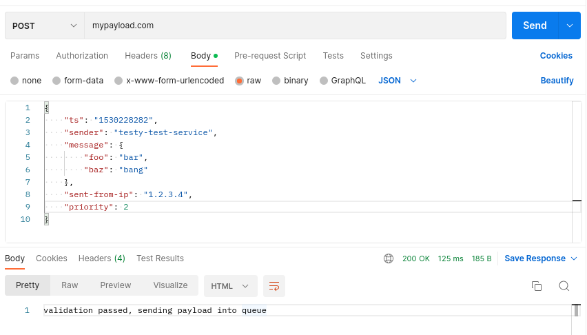


We are done (for now) ! :finnadie:


#TODO database, deploying to cloud, replicas and scalability, OOP(?), remote access, rewrite in GO, proper monitoring
